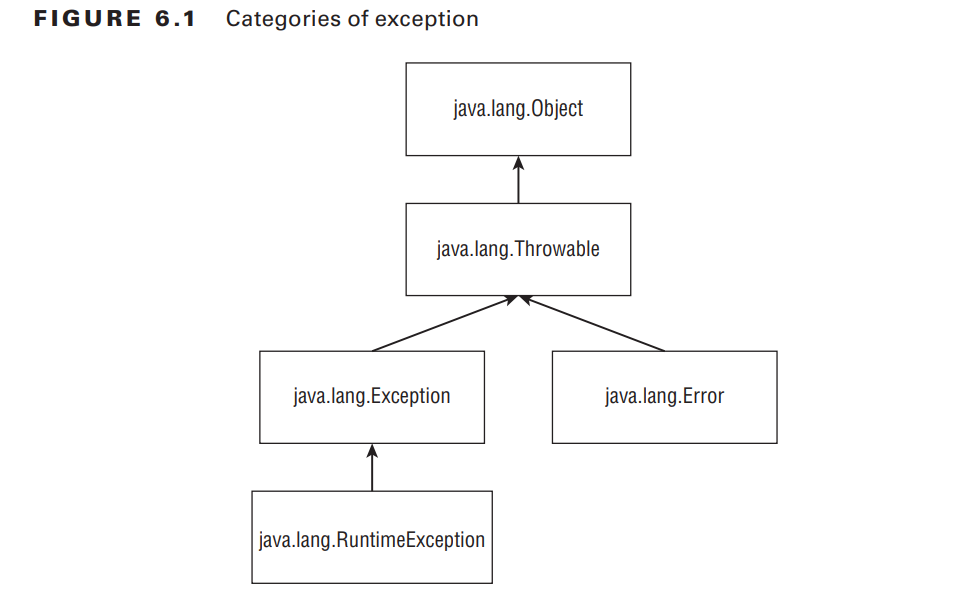
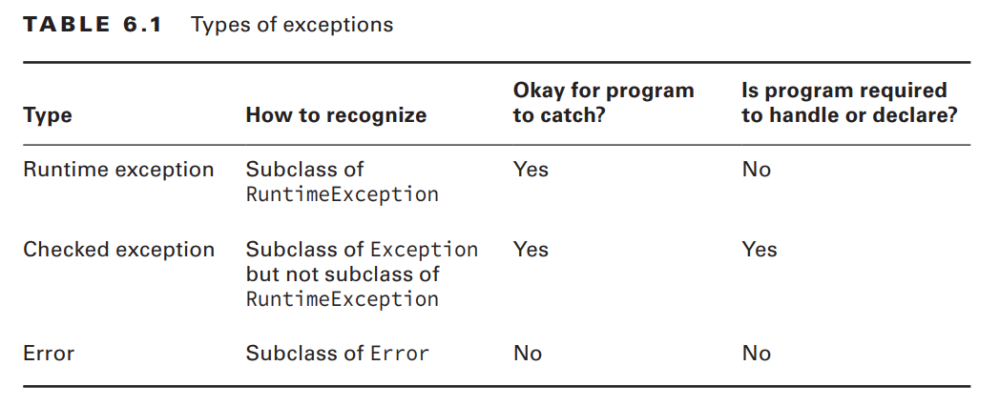
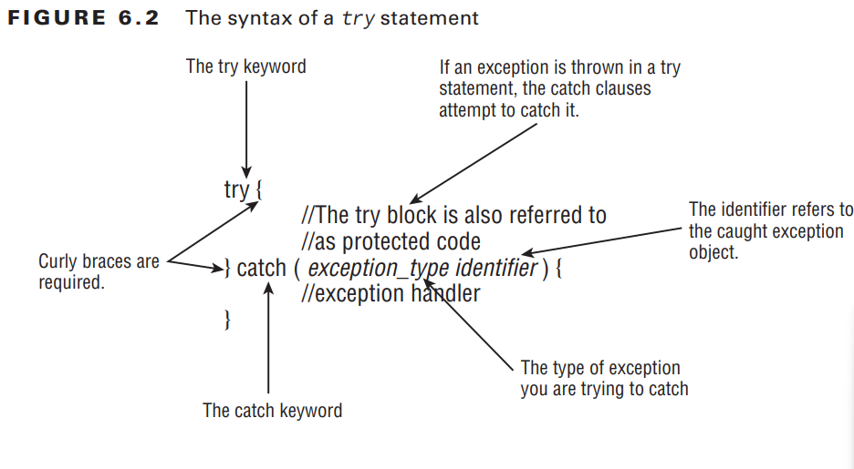
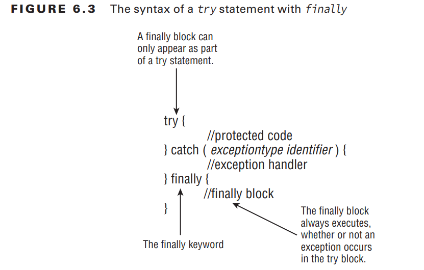

# Understanding Exceptions p.300

A program can fail for just about any reason. Here are just a few possibilities:

- The code tries to connect to a website, but the Internet connection is down.
- You made a coding mistake and tried to access an invalid index in an array.
- One method calls another with a value that the method doesn’t support

## The Role of Exceptions p.300

These are the two approaches Java uses when dealing with exceptions.

- A method canhandle the exception case itself
- or make it the caller’s responsibility.

- An exception forces the program to deal with them or end with the exception if left unhandled,
- whereas a return code could be accidentally ignored and cause problems later in the program. An exception is like shouting, “Deal with me!”

## Understanding Exception Types .p302

an exception is an event that alters program flow. Java has a `Throwable`
superclass for all objects that represent these events.


- `Error` means something went so horribly wrong that your program should not attempt to recover from it.
- `Runtime exceptions` tend to be unexpected but not necessarily fatal.Runtime exceptions are also known as `unchecked exceptions.`
- `Checked exceptions` tend to be more anticipated—for example, trying to read a file that doesn’t exist.

Java requires the code to either handle them or declare them in the method signature when it is a checked exception.

```java
void fall() throws Exception {
 throw new Exception();
}
```

- `throws` simply declares that the method might throw an Exception. It also might not.

For the OCA exam, you need to know the rules for how checked versus unchecked
exceptions function.

## Throwing an Exception p.304

On the exam, you will see two types of code that result in an exception. `The first is code that’s wrong`

```java
String[] animals = new String[0];
System.out.println(animals[0]); //This code throws an ArrayIndexOutOfBoundsException.
```

The second way for code to result in an exception is `to explicitly request Java to throw one`.

```java
throw new Exception();
throw new Exception("Ow! I fell.");
throw new RuntimeException();
throw new RuntimeException("Ow! I fell.");
```



# Using a try Statement p.305

Java uses a `try statement` to separate the logic that might throw an exception from the logic to handle that exception.


The code in the try block is run normally. If any of the statements throw an exception
that can be caught by the exception type listed in the catch block, the try block stops running and execution goes to the catch statement. If none of the statements in the try block
throw an exception that can be caught, the catch clause is not run.

- “block” and “clause” used interchangeably.

```java
 void explore() {
 try {
 fall();
 System.out.println("never get here");
 } catch (RuntimeException e) {
 getUp();
 }
 seeAnimals();
 }
void fall() { throw new RuntimeException(); }
```

```java
try // DOES NOT COMPILE - braces are missing
 fall();
catch (Exception e)
 System.out.println("get up");
```

```java
try {// DOES NOT COMPILE - missing catch clause
 fall();
}
```

## Adding a finally Block p.307

The try statement also lets you run code at the end with a `finally clause` regardless of
whether an exception is thrown.


```java
 void explore() {
 try {
 seeAnimals();
 fall();
 } catch (Exception e) {
 getHugFromDaddy();
 } finally {
 seeMoreAnimals();
 }
 goHome();
 }
```

On the OCA exam, a try statement must have catch and/or finally.

```java
 try { // DOES NOT COMPILE - catch and finally blocks are in the wrong order.
 fall();
 } finally {
 System.out.println("all better");
 } catch (Exception e) {
 System.out.println("get up");
 }

 try { // DOES NOT COMPILE - needs catch/finally block
 fall();
 }

 try { // compiles fine -  catch is not required if finally is present.
 fall();
 } finally {
 System.out.println("all better");
 }
```

When `System.exit` is called in the try or catch block, finally does not run.

## Catching Various Types of Exceptions p.309

the OCA exam can defi ne basic exceptions to show you the hierarchy. You only
need to do two things with this information. First, you must be able to recognize if the
exception is a checked or an unchecked exception.

```java
class AnimalsOutForAWalk extends RuntimeException { }
class ExhibitClosed extends RuntimeException { }
class ExhibitClosedForLunch extends ExhibitClosed { }
```

```java
public void visitPorcupine() {
 try {
 seeAnimal();
 } catch (AnimalsOutForAWalk e) {// first catch block
 System.out.print("try back later");
 } catch (ExhibitClosed e) {// second catch block
 System.out.print("not today");
 }
}
```

A rule exists for the order of the catch blocks. Java looks at them in the order they
appear. If it is impossible for one of the catch blocks to be executed, a compiler error
about unreachable code occurs. `This happens when a superclass is caught before a subclass.`

```java
public void visitMonkeys() {
 try {
 seeAnimal();
 } catch (ExhibitClosedForLunch e) {// subclass exception
 System.out.print("try back later");
 } catch (ExhibitClosed e) {// superclass exception
 System.out.print("not today");
 }
}
```

```java
public void visitMonkeys() {
 try {
 seeAnimal();
 } catch (ExhibitClosed e) {
 System.out.print("not today");
 } catch (ExhibitClosedForLunch e) {// DOES NOT COMPILE - superclass is caught before a subclass - there is no way for the second catch block to ever run
 System.out.print("try back later");
 }
}
```

```java
public void visitSnakes() {
 try {
 seeAnimal();
 } catch (RuntimeException e) {
 System.out.print("runtime exception");
 } catch (ExhibitClosed e) {// DOES NOT COMPILE - ExhibitClosed is a RuntimeException-  no way to get to the second catch block
 System.out.print("not today");
 } catch (Exception e) {
 System.out.print("exception");
 }
}
```

## Throwing a Second Exception p.311

a catch or finally block can have any valid Java code in it—including another
try statement.

Most of the examples you see with exception handling on the exam are abstract. They
use letters or numbers to make sure you understand the fl ow. This one shows that only the
last exception to be thrown matters.

```java
 try {
 throw new RuntimeException();
 } catch (RuntimeException e) {
 throw new RuntimeException(); //The exception from the catch block gets forgotten about.
 } finally {
 throw new Exception(); // last exception to be thrown matters
 }
```

```java
 public String exceptions() {
 String result = "";
 String v = null;
 try {
 try {
 result += "before";
 v.length();
 result += "after";
 } catch (NullPointerException e) {
 result += "catch";
 throw new RuntimeException();
 } finally {
 result += "finally";
 throw new Exception();
 }
 } catch (Exception e) {
 result += "done";
 }
 return result;
}
// Outputss: before catch finally done
```

# Recognizing Common Exception Types p.313

- runtime exceptions,
- checked exceptions,
- and errors.

you’ll need to recognize which type of an exception it is and whether it’s thrown by
the JVM or a programmer.

## Runtime Exceptions p.314

- `ArithmeticException ` -Thrown by the JVM when code attempts to divide by zero

```java
int answer = 11 / 0;
// Exception in thread "main" java.lang.ArithmeticException: / by zero
```

- `ArrayIndexOutOfBoundsException` - Thrown by the JVM when code uses an illegal index to access an array

```java
int[] countsOfMoose = new int[3];
System.out.println(countsOfMoose[-1]);
// Exception in thread "main" java.lang.ArrayIndexOutOfBoundsException: -1

int total = 0;
int[] countsOfMoose = new int[3];
for (int i = 0; i <= countsOfMoose.length; i++)
 total += countsOfMoose[i];

 // Exception in thread "main" java.lang.ArrayIndexOutOfBoundsException: 3
```

- `ClassCastException` - Thrown by the JVM when an attempt is made to cast an exception to a subclass of which it is not an instance

```java
String type = "moose";
Integer number = (Integer) type; // DOES NOT COMPILE

String type = "moose";
Object obj = type;
Integer number = (Integer) obj;

// Exception in thread "main" java.lang.ClassCastException: java.lang.String cannot be cast to java.lang.Integer

```

- `IllegalArgumentException` - Thrown by the programmer to indicate that a method has been passed an illegal or inappropriate argument

```java
public static void setNumberEggs(int numberEggs) {
 if (numberEggs < 0)
 throw new IllegalArgumentException(
 "# eggs must not be negative");
 this.numberEggs = numberEggs;
}

// Exception in thread "main" java.lang.IllegalArgumentException: # eggs must not be negative
```

- `NullPointerException` - Thrown by the JVM when there is a null reference where an object is required

```java
String name;
public void printLength() throws NullPointerException {
 System.out.println(name.length());
}

// Exception in thread "main" java.lang.NullPointerException
```

- `NumberFormatException` - Thrown by the programmer when an attempt is made to convert a string to a numeric type but the string doesn’t have an appropriate format.
  Java provides methods to convert strings to numbers. When these are passed an invalid value, they throw a NumberFormatException.

```java
Integer.parseInt("abc");

// Exception in thread "main" java.lang.NumberFormatException: For input string: "abc"
```

## Checked Exceptions p.317

They must be handled or declared. They can be thrown by the programmer or by the JVM.

- `FileNotFoundException` - Thrown programmatically when code tries to reference a fi le that does not exist
- `IOException` - Thrown programmatically when there’s a problem reading or writing a fi le

## Errors p.317

Errors extend the Error class. They are thrown by the JVM and should not be handled or declared.

- `ExceptionInInitializerError` - Thrown by the JVM when a static initializer throwsan exception and doesn’t handle it

```java
static {
 int[] countsOfMoose = new int[3];
 int num = countsOfMoose[-1];
}
public static void main(String[] args) { }
// Exception in thread "main" java.lang.ExceptionInInitializerError
// Caused by: java.lang.ArrayIndexOutOfBoundsException: -1
```

- `StackOverflowError` - Thrown by the JVM when a method calls itself too many times (this is called `infinite recursion` because the method typically calls itself without end)

```java
public static void doNotCodeThis(int num) {
 doNotCodeThis(1);
}
// Exception in thread "main" java.lang.StackOverflowError
```

- `NoClassDefFoundError` - Thrown by the JVM when a class that the code uses is available at compile time but not runtime. NoClassDefFoundError occurs when Java can’t find the class at runtime.

# Calling Methods That Throw Exceptions p. 318

```java
class NoMoreCarrotsException extends Exception {}
public class Bunny {
 public static void main(String[] args) {
 eatCarrot();// DOES NOT COMPILE  - checked exception must be handled or declared
 }
 private static void eatCarrot() throws NoMoreCarrotsException {
 }
}
```

```java
public static void main(String[] args)
 throws NoMoreCarrotsException {// declare exception - didn’t actually throw an exception; it just declared that it could.
 eatCarrot();
}
public static void main(String[] args) {
 try {
 eatCarrot();
 } catch (NoMoreCarrotsException e ) {// handle exception
 System.out.print("sad rabbit");
 }
}
```

Declaring an unused exceptionisn’t considered unreachable code.
It gives the method the option to change the implementation to throw that exception in the future.

## Subclasses p.319

- When a class overrides a method from a superclass or implements a method from an interface,
  it’s not allowed to add new checked exceptions to the method signature.
- A subclass is allowed to declare fewer exceptions than the superclass or interface. This is
  legal because callers are already handling them.

```java
class Hopper {
 public void hop() throws CanNotHopException { }
}
class Bunny extends Hopper {
 public void hop() { }
}
```

- A subclass not declaring an exception is similar to a method declaring it throws an
  exception that it never actually throws. Similarly, a class is allowed to declare a subclass of an exception type. The idea is the
  same. The superclass or interface has already taken care of a broader type.

```java
class Hopper {
 public void hop() throws Exception { }
}
class Bunny extends Hopper {
 public void hop() throws CanNotHopException { }
}
```

it’s okay to declare new runtime exceptions in a subclass method is that
the declaration is redundant. Methods are free to throw any runtime exceptions they want
without mentioning them in the method declaration.

```java
class Hopper {
 public void hop() { }
}
class Bunny extends Hopper {
 public void hop() throws IllegalStateException { }
}
```

## Printing an Exception p.321

There are three ways to print an exception. You can let Java print it out, print just the message, or print where the stack trace comes from.

```java
 public static void main(String[] args) {
 try {
 hop();
 } catch (Exception e) {
 System.out.println(e);
 System.out.println(e.getMessage());
 e.printStackTrace();
 }
 }
 private static void hop() {
 throw new RuntimeException("cannot hop");
 }

 //java.lang.RuntimeException: cannot hop -  the exception type and message
//cannot hop - just the message
//java.lang.RuntimeException: cannot hop  -shows a stack trace
//at trycatch.Handling.hop(Handling.java:15)
//at trycatch.Handling.main(Handling.java:7)
```

# Summary p.323

An exception indicates something unexpected happened. A method can handle an exception by catching it or declaring it for the caller to deal with. Many exceptions are thrown
by Java libraries. You can throw your own exception with code such as throw newException().

- Subclasses of java.lang.Error are exceptions that a programmer should not attempt to
  handle.
- Subclasses of java.lang.RuntimeException are runtime (unchecked) exceptions.
- Subclasses of java.lang.Exception, but not java.lang.RuntimeException are checked exceptions. Java requires checked exceptions to be handled or declared.

If a try statement has multiple catch blocks, at most one catch block can run. Java
looks for an exception that can be caught by each catch block in the order they appear, and
the fi rst match is run. Then execution continues after the try statement. If both catch and
finally throw an exception, the one from finally gets thrown.
Common runtime exceptions include:

- ArithmeticException
- ArrayIndexOutOfBoundsException
- ClassCastException
- IllegalArgumentException
- NullPointerException
- NumberFormatException
  IllegalArgumentException and NumberFormatException are typically thrown by the
  programmer, whereas the others are typically thrown by the JVM.
  Common checked exceptions include:
- IOException
- FileNotFoundException
  Common errors include:
- ExceptionInInitializerError
- StackOverflowError
- NoClassDefFoundError
  When a method overrides a method in a superclass or interface, it is not allowed to add
  checked exceptions. It is allowed to declare fewer exceptions or declare a subclass of a
  declared exception. Methods declare exceptions with the keyword throws.

# Exam Essentials p.324

- `Differentiate between checked and unchecked exceptions.` Unchecked exceptions are also
  known as runtime exceptions and are subclasses of java.lang.RuntimeException. All
  other subclasses of java.lang.Exception are checked exceptions.
- `Understand the flow of a try statement.` A try statement must have a catch or a finally
  block. Multiple catch blocks are also allowed, provided no superclass exception type
  appears in an earlier catch block than its subclass. The finally block runs last regardless
  of whether an exception is thrown.
- `Identify whether an exception is thrown by the programmer or the JVM.` Illegal
  ArgumentException and NumberFormatException are commonly thrown by the programmer. Most of the other runtime exceptions are typically thrown by the JVM.
  Declare methods that declare exceptions. The throws keyword is used in a method declaration to indicate an exception might be thrown. When overriding a method, the method is
  allowed to throw fewer exceptions than the original version.
- `Recognize when to use throw versus throws.` The throw keyword is used when you actually want to throw an exception—for example, throw new RuntimeException(). The
  throws keyword is used in a method declaration

# Review Questions Result

O1. B, C | B
/2. B, D
/3. C
/4. B
/5. A, B, D
/6. C
O7. D | C
O8. D | E
/9. B
/10. E
O11. G| A
O12.A, B, D, E, F | A, B, D, G
O13. E | A, B, C, E.
O14. D, A | A, C, D, E
O15. A, B, D, E
O16. A | B
O17. A, C | A, C, D, E
O18. B, E | A, B, C, E
O19. B, C | C ,E
/20. A, E

9/20

Learnings

- if main doesnt catch exception, it ends program.
- You can declare a method with Exception as the return type.
- You can declare any subclass of Error in the throws part of a method declaration.
- You can declare any subclass of Exception in the throws part of a method
  declaration
- Runtime exceptions can be thrown in any method
- A method that declares an exception isn’t required to throw one
- matches the signature in the interface or superclass is allowed

```java
interface Roar {
 void roar() throws HasSoreThroatException;
}
class Lion implements Roar {// INSERT CODE HERE
void roar() throws HasSoreThroatException;
}
```

- Checked exceptions are allowed to be handled or declared.
- Checked exceptions are required to be handled or declared.
- Errors are allowed to be handled or declared.
- Runtime exceptions are allowed to be handled or declared.
