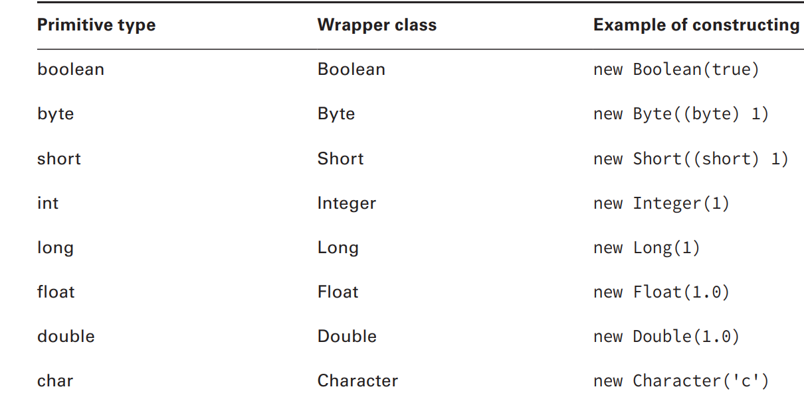

# Creating and Manipulating Strings

A `string` is basically a sequence of characters
String class is special and doesn’t need to be instantiated with new

```java
String name = "Fluffy";
String name = new String("Fluffy");
```

- concatenation,
- immutability,
- the string pool,
- common methods,
- and method chaining.

## Concatenation

Placing one String before the other String and combining them together is called string `concatenation`.

1. If both operands are numeric, + means numeric addition.
2. If either operand is a String, + means concatenation.
3. The expression is evaluated left to right.

```java
System.out.println(1 + 2); // 3
System.out.println("a" + "b"); // ab
System.out.println("a" + "b" + 3); // ab3
System.out.println(1 + 2 + "c"); // 3c
```

## Immutability

Once a String object is created, it is not allowed to change.
It cannot be made larger or smaller, and you cannot change one of the characters inside it.

`Mutable` is another word for changeable
`Immutable` is the opposite—an object that can’t be changed once it’s created.

## The String Pool

The `string pool`, also known as the intern pool, is a location in the Java virtual machine (JVM) that collects all these strings.

```java
String name = "Fluffy"; //it is a literal, so it goes into the string pool
String name = new String("Fluffy"); // creates new object string, doesnt go into the string pool
```

## Important String Methods

The method `length()` returns the number of characters in the String.

```java
String string = "animals";
System.out.println(string.length()); // 7
```

The method `charAt()` lets you query the string to fi nd out what character is at a specific index.

```java
String string = "animals";
System.out.println(string.charAt(0)); // a
System.out.println(string.charAt(6)); // s
System.out.println(string.charAt(7)); // throws exception
```

The method `indexOf()` looks at the characters in the string and finds the first index that matches the desired value.
indexOf can work with an individual character or a whole String as input.
It can also start from a requested position.

```java
String string = "animals";
System.out.println(string.indexOf('a')); // 0
System.out.println(string.indexOf("al")); // 4
System.out.println(string.indexOf('a', 4)); // 4
System.out.println(string.indexOf("al", 5)); // -1
```

The method `substring()` also looks for characters in a string.
The substring() method is the trickiest String method on the exam.
The method returns the string starting from the requested index. If an end index is requested, it stops right before that index. Otherwise, it goes to the end of the string.

```java
String string = "animals";
System.out.println(string.substring(3)); // mals
System.out.println(string.substring(string.indexOf('m'))); // mals
System.out.println(string.substring(3, 4)); // m
System.out.println(string.substring(3, 7)); // mals

System.out.println(string.substring(3, 3)); // empty string
System.out.println(string.substring(3, 2)); // throws exception
System.out.println(string.substring(3, 8)); // throws exception
```

`toLowerCase()` and `toUpperCase()`

```java
String string = "animals";
System.out.println(string.toUpperCase()); // ANIMALS
System.out.println("Abc123".toLowerCase()); // abc123
```

`equals()` and `equalsIgnoreCase()`

```java
System.out.println("abc".equals("ABC")); // false
System.out.println("ABC".equals("ABC")); // true
System.out.println("abc".equalsIgnoreCase("ABC")); // true
```

`startsWith()` and `endsWith()`

```java
System.out.println("abc".startsWith("a")); // true
System.out.println("abc".startsWith("A")); // false
System.out.println("abc".endsWith("c")); // true
System.out.println("abc".endsWith("a")); // false
```

The `contains()` method also looks for matches in the String.
The contains() method is a convenience method so you don’t have to write `str.indexOf(otherString) != -1`.

```java
System.out.println("abc".contains("b")); // true
System.out.println("abc".contains("B")); // false
```

The `replace()` method does a simple search and replace on the string.

```java
System.out.println("abcabc".replace('a', 'A')); // AbcAbc
System.out.println("abcabc".replace("a", "A")); // AbcAbc
```

The `trim()` method removes whitespace from the beginning and end of a String.
Removes \t (tab), \n (newline) and \r (carriage return).

```java
System.out.println("abc".trim()); // abc
System.out.println("\t a b c\n".trim()); // a b c
```

length()
charAt(int index)
indexOf(char ch || String s)
subString(int beginIndexint || beginIndex, int endIndex)
toLowerCase(String s)
toUpperCase(String s)
equals(String s) returns boolean
equalsIgnoreCase(String s) returns boolean
startsWith(String prefix) returns boolean
endsWith(String suffix) returns boolean
contains(String s) returns boolean
replace(char ch, char newCh || String s, String newS) return String
trim() return String

## Method Chaining

It is common to call multiple methods on the same String

```java
String start = "AniMaL ";
String trimmed = start.trim(); // "AniMaL"
String lowercase = trimmed.toLowerCase(); // "animal"
String result = lowercase.replace('a', 'A'); // "Animal"
System.out.println(result);

// Same as below
String result = "AniMaL ".trim().toLowerCase().replace('a', 'A');
System.out.println(result);
```

# Using the StringBuilder class

The StringBuilder class creates a String without storing all those interim String values. Unlike the String class, StringBuilder is not immutable

## Mutability and Chaining

## Creating a String Builder

```java
StringBuilder sb1 = new StringBuilder(); //containing an empty sequence of characters
StringBuilder sb2 = new StringBuilder("animal"); //containing a specific value
StringBuilder sb3 = new StringBuilder(10); // reserve a certain number of slots for characters
```

## Important StringBuilder Methods

`charAt()`, `indexOf()`, `length()`, and `substring()`
These four methods work exactly the same as in the String class.

The `append()` method is by far the most frequently used method in StringBuilder.
it adds the parameter to the StringBuilder and returns a reference to the current StringBuilder.

```java
StringBuilder sb = new StringBuilder().append(1).append('c');
sb.append("-").append(true);
System.out.println(sb); // 1c-true
```

The `insert()` method adds characters to the StringBuilder at the requested index and
returns a reference to the current StringBuilder.

```java
 StringBuilder sb = new StringBuilder("animals");
 sb.insert(7, "-"); // sb = animals
 sb.insert(0, "-"); // sb = -animals
 sb.insert(4, "-"); // sb = -ani-mals
 System.out.println(sb);
```

`delete()` removes characters from the sequence and returns a reference to the current StringBuilder.
The `deleteCharAt()` method is convenient when you want to delete only one character.

```java
StringBuilder sb = new StringBuilder("abcdef");
sb.delete(1, 3); // sb = adef
sb.deleteCharAt(5); // throws an exception
```

The `reverse()` method does just what it sounds like: it reverses the characters in the sequences and returns a reference to the current StringBuilder.

```java
StringBuilder sb = new StringBuilder("ABC");
sb.reverse();
System.out.println(sb); // CBA
```

`toString()` The last method converts a StringBuilder into a String.

length()
charAt(int index)
indexOf(char ch || String s)
subString(int beginIndexint || beginIndex, int endIndex)
append(String str)
insert(int offset, String str)
delete(int start, int end)
deleteCharAt(int index)
reverse()
toString()

## StringBuilder vs. StringBUffer

When writing new code that concatenates a lot of String objects together, you should use StringBuilder.

# Understanding Equality

```java
String x = "Hello World";
String y = "Hello World";
System.out.println(x == y); // true
```

Remember that Strings are immutable and literals are pooled. The JVM created only one literal in memory.
x and y both point to the same location in memory; therefore, the statement outputs true.

```java
String x = "Hello World"; // added to string pool on compile time
String z = " Hello World".trim(); //creates new object at runtime
System.out.println(x == z); // false, isnt the same at compile time

String x = new String("Hello World"); //creates new object String, different String object
String y = "Hello World"; // added to string pool on compile time
System.out.println(x == y); // false
```

`equals()` to check the values inside the String rather than the String itself

```java
String x = "Hello World";
String z = " Hello World".trim();
System.out.println(x.equals(z)); // true
```

If you call `equals()` on two StringBuilder instances, it will check reference equality.

```java
Tiger t1 = new Tiger();
Tiger t2 = new Tiger();
Tiger t3 = t1;
System.out.println(t1 == t1); // true - we are comparing references to the same object
System.out.println(t1 == t2); // false -  false because the two object references are different
System.out.println(t1.equals(t2)); // false - false since Tiger does not implement equals()
```

# Understanding Java Arrays

An `array` is an area of memory on the heap with space for a designated number of elements
A `String` is `implemented as an array` with some methods that you might want to use when dealing with characters specifically
A `StringBuilder` is `implemented as an array` where the array object is
replaced with a new bigger array object when it runs out of space to store all the characters.

## Creating an Array of Primitives

```java
int[] numbers1 = new int[3];
int[] numbers2 = new int[] {42, 55, 99};

int[] numAnimals;
int [] numAnimals2;
int numAnimals3[];
int numAnimals4 [];
```

Arrays can be initialized using anonymous initializers.
For example:

```java
int[] numbers = {1, 2, 3, 4}; // Declaration and initialization at the same time.
```

## Creating an Array with Reference Variable

```java
class Names {
 String names[]; // code never instantiated the array so it is just a reference variable to null
}
```

```java
class Names {
 String names[] = new String[2]; // array of type String, length = 2, each slot is currently null.
}
```

## Using an Array

```java
public static void main(String[] args) {
        String[] mammals = { "monkey", "chimp", "donkey" };
        mammals[3] = "cat"; // throws exception
        System.out.println(mammals);
    }
```

## Sorting

```java
import java.util.* // import whole package including Arrays
import java.util.Arrays; // import just Arrays

int[] numbers = { 6, 9, 1 };
Arrays.sort(numbers);
for (int i = 0; i < numbers.length; i++)
System.out.print (numbers[i] + " "); // Outputs 1 6 9
```

Sort can be also used with String types

```java
String[] strings = { "10", "9", "100" };
Arrays.sort(strings);
for (String string : strings)
 System.out.print(string + " "); // Outputs: 10 100 9 String sorts in alphabetic order
```

Numbers sort before letters & uppercase sorts before lowercase

## Searching

Java also provides a convenient way to search—but only if the array is already sorted.

```java
import java.util.Arrays;

/**
 * Search
 */
public class Search {

    public static void main(String[] args) {
        int[] numbers = { 2, 4, 6, 8 };
        System.out.println(Arrays.binarySearch(numbers, 2)); // 0
        System.out.println(Arrays.binarySearch(numbers, 4)); // 1
        System.out.println(Arrays.binarySearch(numbers, 1)); // -1
        System.out.println(Arrays.binarySearch(numbers, 3)); // -2
        System.out.println(Arrays.binarySearch(numbers, 9)); // -5 | 9 should be inserted at index 4. we negate = -4 and subtract 1 = -5
    }
}
```

As soon as you see the array isn’t sorted, look for an answer choice about unpredictable output.
On the exam, you need to know what a binary search returns in various scenarios

## Varargs

```java
public static void main(String[] args)
public static void main(String args[])
public static void main(String... args) // varargs - syntax called varargs (variable arguments)
```

## Multidimensional Arrays

arrays can hold other arrays

## Creating a Multidimensional Array

```java
int[][] vars1; // 2D array
int vars2 [][]; // 2D array
int[] vars3[]; // 2D array
int[] vars4 [], space [][]; // a 2D AND a 3D array

//You can specify the size of your multidimensional array in the declaration
String [][] rectangle = new String[3][2];
```

Another way to create an asymmetric array is to initialize just an array’s fi rst dimension
and defi ne the size of each array component in a separate statement:

```java
int [][] args = new int[4][];
args[0] = new int[5];
args[1] = new int[3];
```

## Using a Multidimensional Array

```java
int[][] twoD = new int[3][2];
for (int i = 0; i < twoD.length; i++) {
 for (int j = 0; j < twoD[i].length; j++)
 System.out.print(twoD[i][j] + " "); // print element
 System.out.println(); // time for a new row
}

// Enhanced For Loop
for (int[] inner : twoD) {
 for (int num : inner)
 System.out.print(num + " ");
 System.out.println();
}
```

# Understanding an ArrayList

Just like a StringBuilder, ArrayList can change size at runtime as needed.

```java
import java.util.*; // import whole package including ArrayList
import java.util.ArrayList; // import just ArrayList
```

## Creating an ArrayList

```java
ArrayList list1 = new ArrayList();  //create an ArrayList containing space for the default number of elements
ArrayList list2 = new ArrayList(10); //create an ArrayList containing a specific number of slots
ArrayList list3 = new ArrayList(list2); //copy of another ArrayList

//Generics - which allow you to specify the type of class that the ArrayList will contain.
ArrayList<String> list4 = new ArrayList<String>();
ArrayList<String> list5 = new ArrayList<>();
```

This is called the diamond operator because <> looks like a diamond.
an ArrayList is a List.
you can store an ArrayList in a List reference variable but not vice versa.
The reason is that List is an interface and interfaces can’t be instantiated.

```java
List<String> list6 = new ArrayList<>();
ArrayList<String> list7 = new List<>(); // DOES NOT COMPILE
```

## Using an Arraylist

`E` is used by convention in generics to mean “any class that this array can hold.”
E means Object

The `add()` methods insert a new value in the ArrayList.
boolean add(E element)
void add(int index, E element)

```java
ArrayList list = new ArrayList(); // type is object
list.add("hawk"); // [hawk]
list.add(Boolean.TRUE); // [hawk, true]
System.out.println(list); // [hawk, true]


ArrayList<String> safer = new ArrayList<>(); // type is String
safer.add("sparrow");
safer.add(Boolean.TRUE); // DOES NOT COMPILE

List<String> birds = new ArrayList<>();
birds.add("hawk"); // [hawk]
birds.add(1, "robin"); // [hawk, robin]
birds.add(0, "blue jay"); // [blue jay, hawk, robin]
birds.add(1, "cardinal"); // [blue jay, cardinal, hawk, robin]
System.out.println(birds); // [blue jay, cardinal, hawk, robin]
```

The `remove()` methods remove the fi rst matching value in the ArrayList or remove the element at a specified index.
boolean remove(Object object)
E remove(int index)

```java
List<String> birds = new ArrayList<>(); // of type String
birds.add("hawk"); // [hawk]
birds.add("hawk"); // [hawk, hawk]
System.out.println(birds.remove("cardinal")); // prints false
System.out.println(birds.remove("hawk")); // prints true
System.out.println(birds.remove(0)); // prints hawk
System.out.println(birds); // []
```

The `set()` method changes one of the elements of the ArrayList without changing the size.
E set(int index, E newElement)

```java
List<String> birds = new ArrayList<>();
birds.add("hawk"); // [hawk]
System.out.println(birds.size()); // 1
birds.set(0, "robin"); // [robin]
System.out.println(birds.size()); // 1
birds.set(1, "robin"); // IndexOutOfBoundsException
```

The `isEmpty()` and `size()` methods look at how many of the slots are in use.
boolean isEmpty()
int size()

```java
System.out.println(birds.isEmpty()); // true
System.out.println(birds.size()); // 0
birds.add("hawk"); // [hawk]
birds.add("hawk"); // [hawk, hawk]
System.out.println(birds.isEmpty()); // false
System.out.println(birds.size()); // 2
```

The `clear()` method provides an easy way to discard all elements of the ArrayList
void clear()

```java
List<String> birds = new ArrayList<>();
birds.add("hawk"); // [hawk]
birds.add("hawk"); // [hawk, hawk]
System.out.println(birds.isEmpty()); // false
System.out.println(birds.size()); // 2
birds.clear(); // []
System.out.println(birds.isEmpty()); // true
System.out.println(birds.size()); // 0
```

The `contains()` method checks whether a certain value is in the ArrayList
boolean contains(Object object)

```java
List<String> birds = new ArrayList<>();
birds.add("hawk"); // [hawk]
System.out.println(birds.contains("hawk")); // true
System.out.println(birds.contains("robin")); // false
```

ArrayList has a custom implementation of `equals()` so you can compare two lists
to see if they contain the same elements in the same order.
boolean equals(Object object)

```java
List<String> one = new ArrayList<>();
List<String> two = new ArrayList<>();
System.out.println(one.equals(two)); // true
one.add("a"); // [a]
System.out.println(one.equals(two)); // false
two.add("a"); // [a]
System.out.println(one.equals(two)); // true
one.add("b"); // [a,b]
two.add(0, "b"); // [b,a]
System.out.println(one.equals(two)); // false
```

add()
remove()
set()
isEmpty()
size()
clear()
contains()
equals()

## Wrapper Classes

Each primitive type has a wrapper class


The parse methods, such as parseInt(), return a primitive
and the valueOf() method returns a wrapper class

```java
int primitive = Integer.parseInt("123"); //converts a String to an int primitive
Integer wrapper = Integer.valueOf("123"); // converts a String to an Integer wrapper class.

// letters and dots are not valid for an integer value
int bad1 = Integer.parseInt("a"); // throws NumberFormatException
Integer bad2 = Integer.valueOf("123.45"); // throws NumberFormatException
```

Converting String to primitive

```java
Boolean.parseBoolean("true");
Byte.parseByte("1");
Short.parseShort("1");
Integer.parseInt("1");
Long.parseLong("1");
Float.parseFloat("1");
Double.parseDouble("1");
```

Converting String to wrapper class

```java
Boolean.valueOf("TRUE");
Byte.valueOf("2");
Short.valueOf("2");
Integer.valueOf("2");
Long.valueOf("2");
Float.valueOf("2.2");
Double.valueOf("2.2");
```

## Autoboxing

## Converting Between array and List

## Sorting

# Working with Dates and Times

## Creating Dates and Times

## Manipulating Dates and Times

## Working with Periods

## Formatting Dates and Times

## Parsing Dates and Times

# Summary

# Review Question Results

182/198
