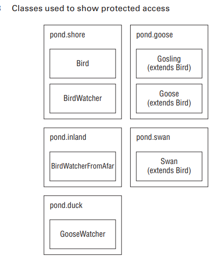
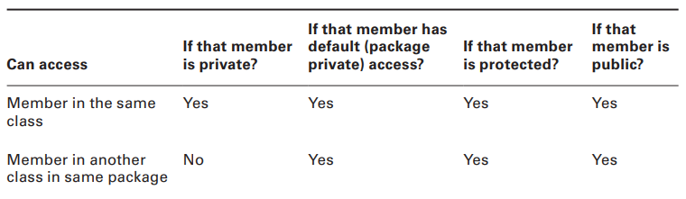
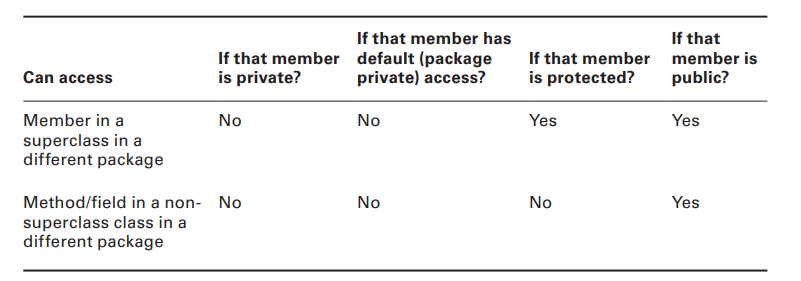
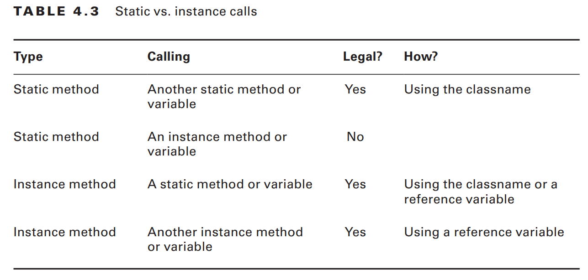
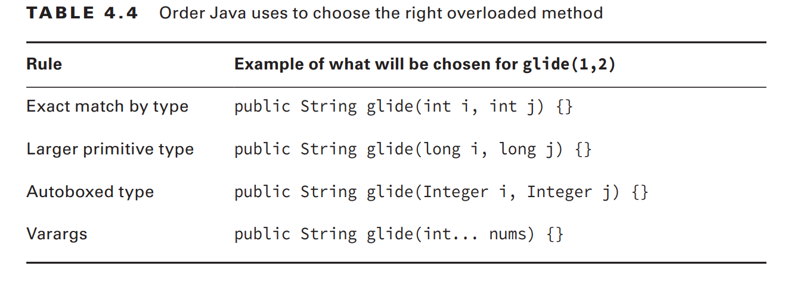

# Designing Methods

`Method declaration`, which specifies all the information needed to call the method.

```java
public final void nap(int minutes) throws InterruptedException{
    // method body
}
```

## Access Modifiers

- `public` The method can be called from any class.
- `private` The method can only be called from within the same class.
- `protected` The method can only be called from classes in the same package or subclasses.
- `default` The method can only be called from classes in the same package. There is no keyword for default access. You simply omit the access modifier.

```java
public void walk1() {}
default void walk2() {} // DOES NOT COMPILE
void public walk3() {} // DOES NOT COMPILE
void walk4() {} // default access - same as omitting the access modifier
```

## Optional Specifiers

You can have multiple specifiers in the same method, you can specify them in any order.

- `static` Covered later in this chapter. Used for class methods.
- `abstract` Covered in Chapter 5. Used when not providing a method body.
- `final` Covered in Chapter 5. Used when a method is not allowed to be overridden by a subclass.

```java
public void walk1() {}
public final void walk2() {}
public static final void walk3() {}
public final static void walk4() {}
public modifier void walk5() {} // DOES NOT COMPILE
public void final walk6() {} // DOES NOT COMPILE
final public void walk7() {}
```

Java allows the optional specifiers to appear before the access modifiers.

## Return Type

Remember that a method must have a return type. If no value is returned,
the return type is void.

```java
public void walk1() { }
public void walk2() { return; }
public String walk3() { return ""; }
public String walk4() { } // DOES NOT COMPILE
public walk5() { } // DOES NOT COMPILE
String walk6(int a) { if (a == 4) return ""; } // DOES NOT COMPILE

int integerExpanded() {
 int temp = 9;
 return temp;
}
int longExpanded() {
 int temp = 9L; // DOES NOT COMPILE - You can’t stuff that long into an int variable
 return temp;
}
```

## Method Name

- Method names follow the same rules as we practiced with variable names.
- an identifier may only contain letters, numbers, $, or \_.
- first character is not allowed to be a number, and reserved words are not allowed.

```java
public void walk1() { }
public void 2walk() { } // DOES NOT COMPILE - identifi ers are not allowed to begin with numbers.
public walk3 void() { } // DOES NOT COMPILE - method name comes before return type
public void Walk_$() { }
public void() { } // DOES NOT COMPILE - method name is missing
```

## Parameter List

Although the parameter list is required, it doesn’t have to contain any parameters.

```java
public void walk1() { }
public void walk2 { } // DOES NOT COMPILE - missing the parentheses around the parameter list
public void walk3(int a) { }
public void walk4(int a; int b) { } // DOES NOT COMPILE - comma must be used to separate parameters
public void walk5(int a, int b) { }
```

## Optional Exception List

You can list as many types of exceptions as you want in this clause separated by commas.

```java
public void zeroExceptions() { }
public void oneException() throws IllegalArgumentException { }
public void twoExceptions() throws IllegalArgumentException, InterruptedException { }
```

## Method Body

`Abstract Methods` and `Interfaces` do not have a method body. A method body is simply a code block.

```java
public void walk1() { }
public void walk2; // DOES NOT COMPILE
public void walk3(int a) { int name = 5; }
```

# Working with Varargs

- A `vararg parameter` must be the `last element` in a method’s parameter list.
- This implies you are only allowed to have `one vararg parameter per method`.

```java
public void walk1(int... nums) { }
public void walk2(int start, int... nums) { }
public void walk3(int... nums, int start) { } // DOES NOT COMPILE - varargs must be the last parameter
public void walk4(int... start, int... nums) { } // DOES NOT COMPILE - varargs must be only one per method
```

You can pass in an array, or you can list the elements of the array and let Java create it for you.

```java
 public static void walk(int start, int... nums) {
 System.out.println(nums.length);
 }
 public static void main(String[] args) {
 walk(1); // 0 - Java creates an array of length 0 for nums
 walk(1, 2); // 1 - converts this one value to an array of length 1
 walk(1, 2, 3); // 2 - converts these two value to an array of length 2
 walk(1, new int[] {4, 5}); // 2 - passes 1 as start and an array of length 2 directly as nums.
 walk(1, null); // throws a NullPointerException
 }
```

Accessing a vararg parameter is also just like accessing an array.

```java
 public static void run(int... nums) {
 System.out.println(nums[1]);
 }
 public static void main(String[] args) {
 run(11, 22); // 22
 }
```

# Applying Access Modifiers

- `private`: Only accessible within the same class
- `default (package private) access`: private and other classes in the same package
- `protected`: default access and child classes
- `public`: protected and classes in the other packages

## Private Access

`Private` access is easy. Only code in the same class can call private methods or access private fields.

```java
 package pond.duck;
 public class FatherDuck {
 private String noise = "quack";
 private void quack() {
 System.out.println(noise); // private access is ok
 }
 private void makeNoise() {
 quack(); // private access is ok
 } }

 package pond.duck;
 public class BadDuckling {
 public void makeNoise() {
 FatherDuck duck = new FatherDuck();
 duck.quack(); // DOES NOT COMPILE - method is private
 System.out.println(duck.noise); // DOES NOT COMPILE - field is private
} }
```

## Default (Package Private) Access

When there is no access modifier, Java uses the `default`, which is package private access.
This means that the member is “private” to classes in the same package.
Only classes in the package may access it.

```java
package pond.duck;
public class MotherDuck {
 String noise = "quack";
 void quack() {
 System.out.println(noise); // default access is ok
 }
 private void makeNoise() {
 quack(); // default access is ok
 } }

 package pond.duck;
public class GoodDuckling {
 public void makeNoise() {
 MotherDuck duck = new MotherDuck();
 duck.quack(); // default access
 System.out.println(duck.noise); // default access
 } }

 package pond.swan;
import pond.duck.MotherDuck; // import another package
public class BadCygnet {
 public void makeNoise() {
 MotherDuck duck = new MotherDuck();
 duck.quack(); // DOES NOT COMPILE - must be in the same package to access a default method
 System.out.println(duck.noise); // DOES NOT COMPILE - must be in the same package to access a default field
 } }
```

## Protected Access

`Protected access` allows everything that default (package private) access allows and more.
The `protected access` modifier adds the ability to access members of a parent class.


```java
package pond.shore;
public class Bird {
 protected String text = "floating"; // protected access
 protected void floatInWater() { // protected access
 System.out.println(text);
 } }

// Creating sub class
package pond.goose;
import pond.shore.Bird; // in a different package
public class Gosling extends Bird { // extends means create subclass
 public void swim() {
 floatInWater(); // calling protected member
 System.out.println(text); // calling protected member
 } }
```

Extending means creating a subclass that has access to any protected or public members of the parent class.
Remember that protected also gives us access to everything that default access does.
This means that a class in the same package as Bird can access its protected members

```java
package pond.shore; // same package as Bird
public class BirdWatcher {
 public void watchBird() {
 Bird bird = new Bird();
 bird.floatInWater(); // calling protected member
 System.out.println(bird.text); // calling protected member
 } }
```

The definition of protected allows access to subclasses and classes in the same package.

```java
package pond.swan;

import pond.shore.Bird; // in different package than Bird

public class Swan extends Bird { // but subclass of Bird

    public void swim() {
        floatInWater(); // package access to superclass via inherting - A member is used without referring to a variable
        System.out.println(text); // package access to superclass via via inherting - A member is used without referring to a variable
    }

    public void helpOtherSwanSwim() {
        Swan other = new Swan();
        other.floatInWater(); // package access to superclass via inherting of Swan Object - A member is used through a variable(other)
        System.out.println(other.text); // package access to superclass via inherting  of Swan Object - A member is used through a variable
    }

    public void helpOtherBirdSwim() {
        Bird other = new Bird();
        other.floatInWater(); // DOES NOT COMPILE - Bird class from a different package -A member is used through a variable
        System.out.println(other.text); // DOES NOT COMPILE - Bird class from a different package -A member is used through a variable
    }
}
```

```java
package pond.goose;

import pond.shore.Bird;

public class Goose extends Bird {

    public void helpGooseSwim() {
        Goose other = new Goose();
        other.floatInWater();
        System.out.println(other.text);
    }

    public void helpOtherGooseSwim() {
        Bird other = new Goose();
        other.floatInWater(); // DOES NOT COMPILE - not allowed to refer to members of the Bird class since we are not in the same package
        System.out.println(other.text); // DOES NOT COMPILE - - not allowed to refer to members of the Bird class since we are not in the same package
    }
}
```

```java
package pond.duck;

import pond.goose.Goose;

public class GooseWatcher {

    public void watch() {
        Goose goose = new Goose();
        goose.floatInWater(); // DOES NOT COMPILE -we are not in the Goose class
        // GooseWatcher is not in the same package as Bird, nor does it extend Bird
    }
}
```

## Public Access

`Public` means anyone can access the member from anywhere.

```java
package pond.duck;

public class DuckTeacher {
    public String name = "helpful"; // public access

    public void swim() { // public access
        System.out.println("swim");
    }
}

package pond.goose;

import pond.duck.DuckTeacher;

public class LostDuckling {

    public void swim() {
        DuckTeacher teacher = new DuckTeacher();
        teacher.swim(); // allowed
        System.out.println("Thanks " + teacher.name); // allowed
    }
}
```

Remember that a member is a method or field.



## Designing Static Methods and Fields

Static methods don't require an object to be created/ an instance of the class.
They are shared among all users of the class.

```java
public class Koala {
 public static int count = 0; // static variable
 public static void main(String[] args) { // static method
 System.out.println(count);
 }
}

public class KoalaTester {
 public static void main(String[] args) {
 Koala.main(new String[0]); // call static method
 // Prints count = 0
 }
}
```

In addition to main() methods, static methods have two main purposes:

- For utility or helper methods that don’t require any object state. Since there is no need
  to access instance variables, having static methods eliminates the need for the caller to
  instantiate the object just to call the method.
- For state that is shared by all instances of a class, like a counter. All instances must
  share the same state. Methods that merely use that state should be static as well.

## Calling a Static Variable or Method

You can use an instance of the object to call a static method.
The compiler checks for the type of the reference and uses that instead of the object—which is sneaky of Java.

```java
Koala k = new Koala();
System.out.println(k.count); // Prints 0 - k is a Koala
k = null;
System.out.println(k.count); // Prints 0 -k is still a Koala
```

Remember to look at the reference type for a variable when you see a static method or variable.

## Static vs. Instance

A static member cannot call an instance member.

```java
public class Static {
 private String name = "Static class";
 public static void first() { }
 public static void second() { }
 public void third() { System.out.println(name); }
 public static void main(String args[]) {
 first();
 second();
 third(); // DOES NOT COMPILE - making a static reference to a nonstatic method.
 } }
```

- A static method or instance method can call a static
  method because static methods don’t require an object to use.
- Only an instance method can
  call another instance method on the same class without using a reference variable, because
  instance methods do require an object.
- non-static method = instance method
  

```java
public class Gorilla {
public static int count;
public static void addGorilla() { count++; } // static method can call static field
public void babyGorilla() { count++; } // instance method can call static field
public void announceBabies() {
addGorilla();
babyGorilla();
}
public static void announceBabiesToEveryone() {
addGorilla();
babyGorilla(); // DOES NOT COMPILE - static method cannot call an instance method
}
public int total;
public static average = total / count; // DOES NOT COMPILE -static variable is trying to use an instance variable
}
```

A common use for static variables is counting the number of instances:

```java
public class Counter {
 private static int count;
 public Counter() { count++; }
 public static void main(String[] args) {
 Counter c1 = new Counter();
 Counter c2 = new Counter();
 Counter c3 = new Counter();
 System.out.println(count); // 3
 //Each time the constructor gets called, it increments count by 1
 }
}
```

## Static Variables

Some static variables are meant to change as the program runs

```java
public class Initializers {
 private static int counter = 0; // initialization
}
```

Other static variables are meant to never change during the program. This type of variable is known as a `constant`.
It uses the `final` modifier to ensure the variable never changes.

```java
public class Initializers {
 private static final int NUM_BUCKETS = 45;
 public static void main(String[] args) {
 NUM_BUCKETS = 5; // DOES NOT COMPILE - cannot update a final variable
 //error: cannot assign a value to final variable NUM_BUCKETS
 } }
```

```java
private static final ArrayList<String> values = new ArrayList<>();
public static void main(String[] args) {
 values.add("changed"); // We are allowed to call methods on reference variables.
}
```

## Static Initialization

```java
 public static void main(String[] args) {
 { System.out.println("Feathers"); }
 }
 { System.out.println("Snowy"); } // instance initializers
```

```java
private static final int NUM_SECONDS_PER_HOUR;
static { // static initializers
 int numSecondsPerMinute = 60;
 int numMinutesPerHour = 60;
 NUM_SECONDS_PER_HOUR = numSecondsPerMinute * numMinutesPerHour;
}
```

The static initializer runs when the class is first used.
We just got through saying that fi nal variables aren’t allowed to
be reassigned. The key here is that the static initializer is the fi rst assignment.
And since it occurs up front, it is okay

```java
private static int one;
private static final int two;
private static final int three = 3;
private static final int four; // DOES NOT COMPILE - never gets initialized.
static {
one = 1;
two = 2;
three = 3; // DOES NOT COMPILE - already initialized
two = 4; // DOES NOT COMPILE - cannot reassign new value
}
```

## Static Imports

Regular imports are for importing classes.
Static imports are for importing static members of classes.

```java
// Regular Import
import java.util.List;
import java.util.Arrays;
public class Imports {
 public static void main(String[] args) {
 List<String> list = Arrays.asList("one", "two");
 }
}

// Static Import
import java.util.List;
import static java.util.Arrays.asList; // static import - specifi cally importing the asList method
public class StaticImports {
 public static void main(String[] args) {
 List<String> list = asList("one", "two"); // no Arrays.
 }
}
```

if we created an asList method in our StaticImports class. Java would give it preference over the imported one and the method
we coded would be used.

```java
import static java.util.Arrays; // DOES NOT COMPILE - using static import to import a class
import static java.util.Arrays.asList;
static import java.util.Arrays.*; // DOES NOT COMPILE - wrong syntax
public class BadStaticImports {
public static void main(String[] args) {
Arrays.asList("one"); // DOES NOT COMPILE - imported the asList method
} }
```

The compiler will complain if you try to explicitly do a static import of
two methods with the same name or two static variables with the same name.

```java
import static statics.A.TYPE;
import static statics.B.TYPE; // DOES NOT COMPILE
```

# Passing Data among methods

Java is a “pass-by-value” language. This means that a copy of the variable is made and the
method receives that copy.

```java
// Primitives
public static void main(String[] args) {
int num = 4;
newNumber(5);
System.out.println(num); // 4
}
public static void newNumber(int num) {
num = 8;
}
```

```java
// Reference Types
public static void main(String[] args) {
 String name = "Webby";
 speak(name);
 System.out.println(name); // Webby
}
public static void speak(String name) {
 name = "Sparky";
}
```

the variable assignment is only to the method parameter and doesn’t affect the caller.

```java
public static void main(String[] args) {
 StringBuilder name = new StringBuilder();
 speak(name);
 System.out.println(name); // Webby
}
public static void speak(StringBuilder s) {
 s.append("Webby"); // method merely calls a method on theparameter
}
```

To review, Java uses `pass-by-value` to get data into a method. Assigning a new primitive
or reference to a parameter doesn’t change the caller. Calling methods on a reference to an
object does affect the caller.

# Overloading Methods

`Method overloading` occurs when there are different method signatures with the same name but different type parameters.
Overloading also allows different numbers of parameters.

```java
//These are all valid overloaded methods:
public void fly(int numMiles) { }
public void fly(short numFeet) { }
public boolean fly() { return false; }
void fly(int numMiles, short numFeet) { }
public void fly(short numFeet, int numMiles) throws Exception { }
```

the parameter list must NOT be the same.

## Overloading and Varargs

```java
public void fly(int[] lengths) { }
// when called
fly(new int[] { 1, 2, 3 });

public void fly(int... lengths) { } // DOES NOT COMPILE - it compiles to the same parameter list
// when called
fly(1, 2, 3);
```

## Autoboxing

Autoboxing when adding primitive int to Integer ArrayList, is the same when calling method.

```java
int primitiveInt = 5;
Integer wrapperInt = primitiveInt; // autoboxing: int to Integer

int anotherPrimitiveInt = wrapperInt; // unboxing: Integer to int

List<Integer> list = new ArrayList<>();
list.add(3); // autoboxes int 3 to Integer
```

When you have overloaded methods—one that takes a primitive (int) and one that takes a wrapper (Integer)—Java will prioritize the method with the primitive parameter because it’s the exact match. Autoboxing is only performed when there's no matching method with a primitive parameter.

```java
public void fly(int numMiles) { /* ... */ }
public void fly(Integer numMiles) { /* ... */ }

fly(3); // Calls the fly(int) method directly without autoboxing
fly(new Integer(3)); // Calls the fly(Integer) method
```

In this case, fly(3) will call fly(int) because it’s a closer match than fly(Integer).

## Reference Types

```java
public class ReferenceTypes {
 public void fly(String s) {
 System.out.print("string ");
 }
 public void fly(Object o) {
 System.out.print("object ");
 }
 public static void main(String[] args) {
 ReferenceTypes r = new ReferenceTypes();
 r.fly("test");
 r.fly(56);
 } }

// Outputs  "string object"
//The fi rst call is a String and fi nds a direct match.
//The second call looks for an int parameter list. When it doesn't fi ndone, it autoboxes to Integer and goes to Object
```

## Primitives

```java
public class Plane {
 public void fly(int i) {
 System.out.print("int ");
 }
 public void fly(long l) {
 System.out.print("long ");
 }
 public static void main(String[] args) {
 Plane p = new Plane();
 p.fly(123);
 p.fly(123L);
 } }
 // Outputs "int long "
 // The fi rst call passes an int and sees an exact match
 // The second call passes a long and also sees an exact match
```

Note that Java can only accept wider types.
If you want to pass a long to a method taking an int parameter, you have to add a cast to explicitly say narrowing is okay.

## Putting It All Together

Java calls the most specific method it can.
autoboxing and varargs come last when Java looks at overloaded methods.


```java
public class Glider2 {
 public static String glide(String s) {
 return "1";
 }
 public static String glide(String... s) {
 return "2";
 }
 public static String glide(Object o) {
 return "3";
 }
 public static String glide(String s, String t) {
 return "4";
 }
 public static void main(String[] args) {
 System.out.print(glide("a"));   // 1
 System.out.print(glide("a", "b"));  // 4
 System.out.print(glide("a", "b", "c"));  // 2
 } }
```

```java
public class TooManyConversions {
 public static void play(Long l) { }
 public static void play(Long... l) { }
 public static void main(String[] args) {
 play(4); // DOES NOT COMPILE - It cannot handle converting in two steps to a long and then to a Long.
 play(4L); // calls the Long version
 } }
```

# Creating Constructors

a `constructor` is a special method that matches the name of the class and has no return type

```java
public class Bunny {
 public Bunny() { // Valid constructor
 System.out.println("constructor");
 }
 public bunny() { } // DOES NOT COMPILE - a method with no return type
public void Bunny() { } // compiles, valid method but not a constructor
}
```

Constructors are used when creating a new object.
This process is called instantiation because it creates a new instance of the class.

```java
// Here’s a common way of writing a constructor:
public class Bunny {
private String color;
public Bunny(String color) {
this.color = color; // assign the parameter color to the instance variable color
} }
```

## Default Constructor

Every class in Java has a constructor whether you code one or not.
Java will create one for you without any parameters.
This Java-created constructor is called the `default constructor`.

```java
public class Rabbit {
 public static void main(String[] args) {
 Rabbit rabbit = new Rabbit(); // Calls default constructor
 }
}
```

244/263

## Overloading Constructors

## Final Fields

## Order of Initialization

# Encapsulating Data

## Creating Immutable Classes

# Writing Simple Lambdas

## Lambda Example

## Lambda Syntax

## Predicates

# Summary

# Exam Essentials

- Be able to identify correct and incorrect method declarations.
- Identify when a method or field is accessible.
- Recognize valid and invalid uses of static imports.
- State the output of code involving methods.
- Evaluate code involving constructors.
- Be able to recognize when a class is properly encapsulated.
- Write simple lambda expressions.

# Review Questions Result
