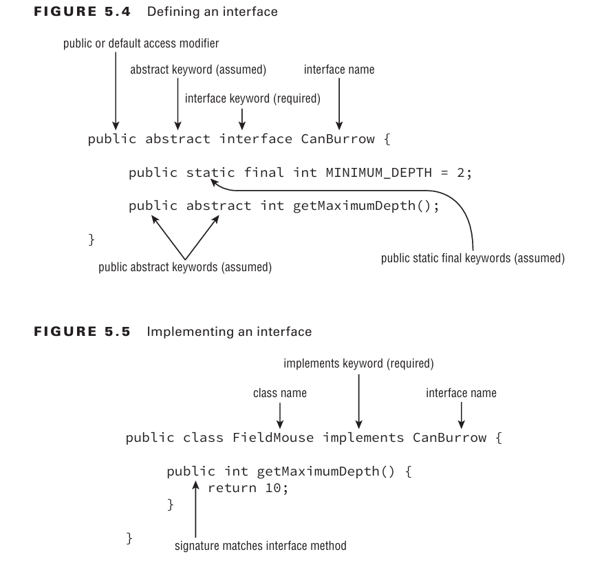

`class structure` is one of the most powerful features in the Java language

- by creating a new `class that extends an existing class`,
  you may gain access to a slew of inherited primitives, objects, and methods
- designing a `standard interface` for your application, you ensure that any class that implements the interface has certain required methods defined.
- creating `abstract class` definitions, you’re defi ning a platform that other developers can extend and build on top of

# Introducing Class Inheritance

`Inheritance` is the process by which the new child subclass automatically includes any
public or protected primitives, objects, or methods defi ned in the parent class.
`single inheritance`, by which a class may inherit from only one direct parent class.
`multiple inheritance`, by which a class may have multiple direct parents.
classes may implement multiple interfaces

## Extending a Class

you can extend a class by adding the parent class name in the definition using the `extends` keyword


## Applying Class Access Modifiers

- The `public access` modifier applied to a class indicates that it can be referenced and used
  in any class.
- The `default` package private modifier, which is the lack of any access modifi er,
  indicates the class can be accessed only by a subclass or class within the same package.
- a Java file can have many classes but `at most one public class or no public class at all`.

```java
//Groundhog.java
class Rodent {}
public class Groundhog extends Rodent {} // only one public class is allowed in a Java file
```

There can be at most `one public class or interface` in a Java file.

## Creating Java Objects

all classes inherit from a single class, java.lang.Object.

```java
// two equivalent class defi nitions
public class Zoo {
}
public class Zoo extends java.lang.Object {
}
```

The key is that when Java sees you defi ne a class that doesn’t extend another class, it
immediately adds the syntax extends java.lang.Object to the class definition.
Any class will always end with java.lang.Object on the top of the tree.

## Defining Constructors

- `this()` - the first statement of every constructor is either a call to another constructor within the class
- `supper()` - the first statement of every constructor is a call to a constructor in the direct parent class.
- the `super()` command may only be used as the fi rst statement of the constructor.

```java
public class Animal {
    private int age;

    public Animal(int age) {
        super(); // call to the parent constructor defi ned in java.lang.Object, which takes no arguments.
        this.age = age;
    }
}

public class Zebra extends Animal {
    public Zebra(int age) {
        super(age); // call to Animal’s constructor, which takes a single argument
    }

    public Zebra() {
        this(4);
    }
}
```

If the parent class has more than one constructor, the child class may use any valid
parent constructor in its defi nition.

```java
public class Animal {
    private int age;
    private String name;

    public Animal(int age, String name) {
        super();
        this.age = age;
        this.name = name;
    }

    public Animal(int age) {
        super();
        this.age = age;
        this.name = null;
    }
}

public class Gorilla extends Animal {
    public Gorilla(int age) {
        super(age, "Gorilla");
    }

    public Gorilla() {
        super(5);
    }
}
```

## Understanding Compiler Enhancements

Java compiler automatically inserts a call to the no-argument constructor super() if the fi rst
statement is not a call to the parent constructor.

```java
// All are equivalent
public class Donkey {
}
public class Donkey {
 public Donkey() {
 }
}
public class Donkey {
 public Donkey() {
 super();
 }
}
```

```java
public class Mammal {
 public Mammal(int age) {
 }
}
public class Elephant extends Mammal { // DOES NOT COMPILE
}
```

```java
public class Mammal {
 public Mammal(int age) {
 }
}
public class Elephant extends Mammal {
 public Elephant() { // DOES NOT COMPILE
 }
}
```

```java
public class Mammal {
 public Mammal(int age) {
 }
}
public class Elephant extends Mammal {
 public Elephant() {
 super(10); // we have added a constructor with an explicit call to a parent constructor.
 }
}
```

Subclasses may defi ne no-argument constructors
even if their parent classes do not, provided the constructor of the child maps to a parent
constructor via an explicit call of the super() command.

## Reviewing Constructor Rules

1. The first statement of every constructor is a call to another constructor within the class
   using this(), or a call to a constructor in the direct parent class using super().
2. The super() call may not be used after the first statement of the constructor.
3. If no super() call is declared in a constructor, Java will insert a no-argument super()
   as the first statement of the constructor.
4. If the parent doesn’t have a no-argument constructor and the child doesn’t define any
   constructors, the compiler will throw an error and try to insert a default no-argument
   constructor into the child class.
5. If the parent doesn’t have a no-argument constructor, the compiler requires an explicit
   call to a parent constructor in each child constructor.

## Calling Constructors

the parent constructor is always executed before the child constructor.

```java
class Primate {
 public Primate() {
 System.out.println("Primate");
 }
}
class Ape extends Primate {
 public Ape() {
 System.out.println("Ape");
 }
}
public class Chimpanzee extends Ape {
 public static void main(String[] args) {
 new Chimpanzee(); // Outputs Primate Ape
 }
}
```

## Calling Inherited Class Members

- Java classes may use any public or protected member of the parent class, including methods, primitives, or object references.
- If the parent class and child class are part of the same package, the child class may also use any default members defi ned in the parent class.
- Finally, a child class may never access a private member of the parent class (must use getters and setters).

```java
class Fish {
 protected int size;
 private int age;

 public Fish(int age) {
 this.age = age;
 }

 public int getAge() {
 return age;
 }
}
public class Shark extends Fish {
 private int numberOfFins = 8;

 public Shark(int age) {
 super(age);
 this.size = 4;
 }

 public void displaySharkDetails() {
 System.out.print("Shark with age: "+getAge()); // calls parent class field with indirectly with getter
 System.out.print(" and "+size+" meters long");// calls parent class field directly - allowed since protected modifier
 System.out.print(" with "+numberOfFins+" fins");// calls instance variable
 }
}
```

You may also use this to access members of the parent class that are accessible from the child class,
since a child class inherits all of its parent members.

```java
public void displaySharkDetails() {
 System.out.print("Shark with age: "+this.getAge());
 System.out.print(" and "+this.size+" meters long");
 System.out.print(" with "+this.numberOfFins+" fins");
}
```

In Java, you can explicitly reference a member of the parent class by using the super keyword.

```java
public void displaySharkDetails() {
 System.out.print("Shark with age: "+super.getAge()); // calls parent class method
 System.out.print(" and "+super.size+" meters long");// calls parent class field
 System.out.print(" with "+this.numberOfFins+" fins"); // calls own class field - compiles
 System.out.print(" with "+super.numberOfFins+" fins"); // DOES NOT COMPILE -  a member of the current class
}
```

- `this` and `super` may both be used for methods or variables defi ned in the parent class.
- only `this` may be used for members defined in the current class.

## Inheriting Methods

Inheriting a class grants us access to the public and protected members of the parent
class, but also sets the stage for collisions between methods defi ned in both the parent class
and the subclass.

## Overriding a Method

you can override a method a method by declaring a new method with the signature and return type as the method in the parent class.
`method signature` includes the name and list of input parameters.

```java
public class Canine {
 public double getAverageWeight() {
 return 50;
 }
}
public class Wolf extends Canine {
 public double getAverageWeight() {
 return super.getAverageWeight()+20;
 }
 public static void main(String[] args) {
 System.out.println(new Canine().getAverageWeight());
 System.out.println(new Wolf().getAverageWeight());
 }
}
// Outputs
// 50.00
// 70.00
```

```java
public double getAverageWeight() {
 return getAverageWeight()+20; // INFINITE LOOP - calls itself, also known as recursion
}
```

The compiler performs the following checks when you override a nonprivate method:

1. The method in the child class must have the same signature as the method in the parent
   class.
2. The method in the child class must be at least as accessible or more accessible than the
   method in the parent class. (private -> default -> protected -> public)
3. The method in the child class may not throw a checked exception that is new or
   broader than the class of any exception thrown in the parent class method. (Exception -> No Exception)
4. If the method returns a value, it must be the same or a subclass of the method in the
   parent class, known as `covariant return types`.

   Any time you see a method on the exam with the same name as a method in the parent
   class, determine whether the method is being overloaded or overridden fi rst; doing so
   will help you with questions about whether the code will compile.

```java
public class Camel {
 protected String getNumberOfHumps() {
 return "Undefined";
 }
}
public class BactrianCamel extends Camel {
 private int getNumberOfHumps() { // DOES NOT COMPILE - protected to private | String to int - non-covariant types
 return 2;
 }
}
```

```java
public class InsufficientDataException extends Exception {}
public class Reptile {
 protected boolean hasLegs() throws InsufficientDataException {
 throw new InsufficientDataException();
 }
 protected double getWeight() throws Exception {
 return 2;
 }
}
public class Snake extends Reptile {
 protected boolean hasLegs() { // allowed (Exception -> No Exception)
 return false;
 }
 protected double getWeight() throws InsufficientDataException{ // allowed (since InsufficientDataException is a subclass of Exception )
 return 2;
 }
}
```

```java
public class InsufficientDataException extends Exception {}
public class Reptile {
 protected double getHeight() throws InsufficientDataException {
 return 2;
 }
 protected int getLength() {
 return 10;
 }
}
public class Snake extends Reptile {
 protected double getHeight() throws Exception { // DOES NOT COMPILE - Exception is a parent/supper class of InsufficientDataException
 return 2;
 }
 // the child class defi nes a new exception that the parent class did not
 protected int getLength() throws InsufficientDataException { // DOES NOT COMPILE - cannot override method that does not throw exception in parent class
 return 10;
 }
}
```

## Redeclaring private Methods

```java
public class Camel {
 private String getNumberOfHumps() {
 return "Undefined";
 }
}
// the method in the child class is a new method and not an override of the method in the parent class.
public class BactrianCamel extends Camel {
 private int getNumberOfHumps() {
 return 2;
 }
}
```

## Hiding Static Methods

A `hidden method` occurs when a child class defi nes a static method with the same name
and signature as a static method defi ned in a parent class.
five rules for hiding a method:

1. The method in the child class must have the same signature as the method in the parent
   class.
2. The method in the child class must be at least as accessible or more accessible than the
   method in the parent class.
3. The method in the child class may not throw a checked exception that is new or
   broader than the class of any exception thrown in the parent class method.
4. If the method returns a value, it must be the same or a subclass of the method in the
   parent class, known as covariant return types.
5. The method defined in the child class must be marked as static if it is marked as
   static in the parent class (method hiding). Likewise, the method must not be marked
   as static in the child class if it is not marked as static in the parent class (method
   overriding).

```java
public class Bear {
 public static void eat() {
 System.out.println("Bear is eating");
 }
}
public class Panda extends Bear {
 public static void eat() {
 System.out.println("Panda bear is chewing");
 }
 public static void main(String[] args) {
 Panda.eat();
 }
}
```

The eat() method in the child class hides the eat() method in the parent class.
Because they are both marked as static, this is not considered an overridden method.

```java
public class Bear {
 public static void sneeze() {
 System.out.println("Bear is sneezing");
 }
 public void hibernate() {
 System.out.println("Bear is hibernating");
 }
}
public class Panda extends Bear {
 public void sneeze() { // DOES NOT COMPILE -  trying to override a method that should be hidden
 System.out.println("Panda bear sneezes quietly");
 }
 public static void hibernate() { // DOES NOT COMPILE - trying to hide a method that should be overridden
 System.out.println("Panda bear is going to sleep");
 }
}
```

## Overriding vs. Hiding Methods

```java
public class Marsupial {
 public static boolean isBiped() { //hidden method, only accesible to this parent class
 return false;
 }
 public void getMarsupialDescription() {
 System.out.println("Marsupial walks on two legs: "+isBiped());
 }
}
public class Kangaroo extends Marsupial {
 public static boolean isBiped() { // hidden method, only accessible to this subclass
 return true;
 }
 public void getKangarooDescription() {
 System.out.println("Kangaroo hops on two legs: "+isBiped());
 }
 public static void main(String[] args) {
 Kangaroo joey = new Kangaroo();
 joey.getMarsupialDescription();
 joey.getKangarooDescription();
 }
}
//Outputs
//Marsupial walks on two legs: false
//Kangaroo hops on two legs: true
//
```

```java
class Marsupial {
 public boolean isBiped() {
 return false;
 }
 public void getMarsupialDescription() {
 System.out.println("Marsupial walks on two legs: "+isBiped());
 }
}
public class Kangaroo extends Marsupial {
 public boolean isBiped() { // overrides method in parent class
 return true;
 }
 public void getKangarooDescription() {
 System.out.println("Kangaroo hops on two legs: "+isBiped());
 }
 public static void main(String[] args) {
 Kangaroo joey = new Kangaroo();
 joey.getMarsupialDescription();
 joey.getKangarooDescription();
 }
}
//Outputs
//Marsupial walks on two legs: true
//Kangaroo hops on two legs: true
//
```

## Creating final methods

- `final methods` cannot be overridden
- you cannot hide a static method in a parent class if it is marked as final.

```java
public class Bird {
 public final boolean hasFeathers() {
 return true;
 }
}
public class Penguin extends Bird {
 public final boolean hasFeathers() { // DOES NOT COMPILE - cannot override final methods
 return false;
 }
}
//Note that whether or not the child method used the final keyword is irrelevant—the code
//will not compile either way.
```

## Inheriting Variables

Java doesn’t allow variables to be overridden but instead hidden.

## Hiding Variables

- If you’re referencing the variable from within the parent class, the variable
  defined in the parent class is used.
- if you’re referencing the variable from
  within a child class, the variable defi ned in the child class is used.

```java
public class Rodent {
 protected int tailLength = 4;
 public void getRodentDetails() {
 System.out.println("[parentTail="+tailLength+"]");
 }
}
public class Mouse extends Rodent {
 protected int tailLength = 8;
 public void getMouseDetails() {
 System.out.println("[tail="+tailLength +",parentTail="+super.tailLength+"]");
 }
 public static void main(String[] args) {
 Mouse mouse = new Mouse();
 mouse.getRodentDetails();
 mouse.getMouseDetails();
 }
}
```

# Creating Abstract Classes

An `abstract class` is a class that is marked with the abstract keyword and cannot be instantiated.
An `abstract method` is a method marked with the abstract keyword defined in an abstract class, for which no implementation is provided in the class in which it is declared.

```java
public abstract class Animal {
 protected int age;
 public void eat() {
 System.out.println("Animal is eating");
 }
 public abstract String getName(); // abstract method - no brackets, end with semicolon
}
public class Swan extends Animal {
 public String getName() { // abstract method overidden
 return "Swan";
 }
}
```

## Defining an Abstract Class

An abstract class is `not required to include any abstract methods`.

```java
public abstract class Cow {
}
```

An abstract class doesn’t have to implement any abstract methods, an abstract method may only be defined in an abstract class.

```java
public class Chicken {
 public abstract void peck(); // DOES NOT COMPILE - not an abstract class
}
```

```java
public abstract class Turtle {
 public abstract void swim() {} // DOES NOT COMPILE - two brackets are provided instead of a semicolon
 public abstract int getAge() { // DOES NOT COMPILE - provides a body to an abstract method
 return 10;
 }
}
```

- an `abstract class cannot be marked as final` for a somewhat obvious reason.
- an abstract class is one that must be extended by another class to
  be instantiated.
- a final class can’t be extended by another class.
- an abstract method may not be marked as final for the same reason that
  an abstract class may not be marked as final.
- a method may not be marked as both abstract and private

```java
public final abstract class Tortoise { // DOES NOT COMPILE
}

// an abstract method may not be marked as final for the same reason that an abstract class may not be marked as final.
public abstract class Goat {
 public abstract final void chew(); // DOES NOT COMPILE
}

// a method may not be marked as both abstract and private
public abstract class Whale {
 private abstract void sing(); // DOES NOT COMPILE
}
public class HumpbackWhale extends Whale {
 private void sing() {
 System.out.println("Humpback whale is singing");
 }
}
```

```java
public abstract class Whale {
 protected abstract void sing();
}
public class HumpbackWhale extends Whale {
 private void sing() { // DOES NOT COMPILE - the subclass cannot reduce the visibility of the parent method
 System.out.println("Humpback whale is singing");
 }
}
```

## Creating a Concrete Class

Abstract classes cannot be instantiated and therefore do not do much other than define static variables and methods.

```java
public abstract class Eel {
 public static void main(String[] args) {
 final Eel eel = new Eel(); // DOES NOT COMPILE
 }
}
```

An abstract class becomes useful when it is extended by a concrete subclass. A `concrete class` is the first nonabstract subclass that extends an abstract class and is required to implement all inherited abstract methods.

```java
public abstract class Animal {
 public abstract String getName();
}
public class Walrus extends Animal { // DOES NOT COMPILE - did not implement abstract methods
}
```

The key point is that the fi rst class to extend the nonabstract class must implement all
inherited abstract methods.

```java
public abstract class Animal {
 public abstract String getName();
}
public class Bird extends Animal { // DOES NOT COMPILE - concrete class must implement all abstract methods
}
public class Flamingo extends Bird {
 public String getName() {
 return "Flamingo";
 }
}
```

## Extending an Abstract Clas

- abstract classes can extend other abstract classes and are
  not required to provide implementations for any of the abstract methods.
- a concrete class that extends an abstract class must implement all inherited abstract
  methods.

```java
public abstract class Animal {
 public abstract String getName();
}
public abstract class BigCat extends Animal {
 public abstract void roar();
}
public class Lion extends BigCat { // concrete class
 public String getName() { // implements abstract method from abstract class Animal
 return "Lion";
 }
 public void roar() {// implements abstract method from abstract class BigCat
 System.out.println("The Lion lets out a loud ROAR!");
 }
}
```

a concrete
subclass is not required to provide an implementation for an abstract method if an intermediate abstract class provides the implementation.

```java
public abstract class Animal {
 public abstract String getName();
}
public abstract class BigCat extends Animal {
 public String getName() {
    return "BigCat";
 }
 public abstract void roar();
}
public class Lion extends BigCat {
 public void roar() {
 System.out.println("The Lion lets out a loud ROAR!");
 }
}
```

if an intermediate class provides an implementation
for an abstract method, that method is inherited by subclasses as a concrete method, not
as an abstract one. In other words, the subclasses do not consider it an inherited abstract
method because it is no longer abstract by the time it reaches the subclasses.

### Abstract Class Definition Rules:

1. Abstract classes cannot be instantiated directly.
2. Abstract classes may be defined with any number, including zero, of abstract and nonabstract methods.
3. Abstract classes may not be marked as private or final.
4. An abstract class that extends another abstract class inherits all of its abstract methods
   as its own abstract methods.
5. The first concrete class that extends an abstract class must provide an implementation
   for all of the inherited abstract methods.

### Abstract Method Definition Rules:

1. Abstract methods may only be defined in abstract classes.
2. Abstract methods may not be declared private or final.
3. Abstract methods must not provide a method body/implementation in the abstract
   class for which is it declared.
4. Implementing an abstract method in a subclass follows the same rules for overriding a
   method. For example, the name and signature must be the same, and the visibility of
   the method in the subclass must be at least as accessible as the method in the parent
   class.

# Implementing Interfaces

- Java allow classes to implement any
  number of interfaces.
- An `interface` is an abstract data type that defi nes a list of abstract
  public methods that any class implementing the interface must provide.
- A class invokes the interface by using the i`mplements keyword` in its class definition.
  

method access modifiers such as bstract and public , are assumed. In other words, whether or not you provide
them, the compiler will automatically insert them as part of the method definition.

```java
public class Elephant implements WalksOnFourLegs, HasTrunk, Herbivore {
}
```

## Defining an Interface

1.  Interfaces cannot be instantiated directly.
2.  An interface is not required to have any methods.
3.  An interface may not be marked as final.
4.  All top-level interfaces are assumed to have public or default access, and they must
    include the abstract modifier in their definition. Therefore, marking an interface as
    ` private, protected, or final` will trigger a compiler error, since this is incompatible
    with these assumptions.
5.  All nondefault methods in an interface are assumed to have the modifiers abstract
    and public in their definition. Therefore, marking a method as `private, protected, or final`
    will trigger compiler errors as these are incompatible with the abstract and
    public keywords.

````java
public interface WalksOnTwoLegs {} // compiles - interface are not required to define any methods.

public class TestClass {
  public static void main(String[] args) {
    WalksOnTwoLegs example = new WalksOnTwoLegs();  // DOES NOT COMPILE -cannot instantiate an interface
  }
 }
 public final interface WalksOnEightLegs {  // DOES NOT COMPILE - cannot be defined as final
 }

```java
 public interface CanFly {
  void fly(int speed);
  abstract void takeoff();
  public abstract double dive();
 }

 // both are equivalent
 public abstract interface CanFly { //  abstract keyword is fi rst automatically added to the interface  defi nition
  public abstract void fly(int speed); //  each method is prepended with abstract and public keywords.
  public abstract void takeoff();
  public abstract double dive();
 }
````

```java
 private final interface CanCrawl {  // DOES NOT COMPILE - interface cannot be private or final
  private void dig(int depth);  // DOES NOT COMPILE -- interface methods cannot be private
  protected abstract double depth();  // DOES NOT COMPILE -- interface methods cannot be protected
  public final void surface();  // DOES NOT COMPILE -- interface methods cannot be final
 }
```

## Inheriting an Interface

There are two inheritance rules you should keep in mind when extending an interface:

1.  An interface that extends another interface, as well as an abstract class that
    implements an interface, inherits all of the abstract methods as its own abstract
    methods.
2.  The first concrete class that implements an interface, or extends an abstract class
    that implements an interface, must provide an implementation for all of the inherited
    abstract methods.

- an interface may be extended using the extend keyword. the new child interface inherits all the abstract methods of the parent interface
- an interface may extend multiple interfaces

```java
 public interface HasTail {
  public int getTailLength();
 }
 public interface HasWhiskers {
  public int getNumberOfWhiskers();
 }
 public interface Seal extends HasTail, HasWhiskers {
 }

 // Any class that implements the Seal interface must provide 
 // an implementation for all methods in the parent interfaces
```

- an abstract class can implement an interface. it is treated the same way as n interface extending another interface.
- the abstract class inherits the abstract methods of the interface but is not required to implement them.
- the first concrete class to extend the abstract  class must implement all the inherited abstract methods of the interface.

```java
public interface HasTail {
  public int getTailLength();
 }
 public interface HasWhiskers {
  public int getNumberOfWhiskers();
 }
 public abstract class HarborSeal implements HasTail, HasWhiskers { // compiles - it inherits abstract methods and no need to implement
 }
 public class LeopardSeal implements HasTail, HasWhiskers {  // DOES NOT COMPILE - it does not implement abstract method of the interface
 }
```
## Classes, Interfaces, and Keywords

316/334

## Abstract Methods and Multiple Inheritance

## Interface Variables

## Default Interface Methods

## Default Methods and Multiple Inheritance

## Static Interface Methods

# Understanding Polymorphism

## Object vs. Reference

## Casting Objects

## Virtual Methods

## Polymorphic Parameters

## Polymorphism and Method Overriding

# Summary

# Exam Essentials

# Review Question Results
