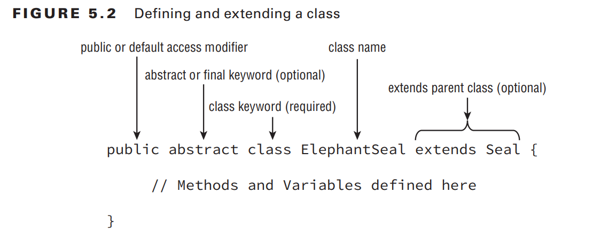

`class structure` is one of the most powerful features in the Java language

- by creating a new `class that extends an existing class`,
  you may gain access to a slew of inherited primitives, objects, and methods
- designing a `standard interface` for your application, you ensure that any class that implements the interface has certain required methods defined.
- creating `abstract class` definitions, you’re defi ning a platform that other developers can extend and build on top of

# Introducing Class Inheritance

`Inheritance` is the process by which the new child subclass automatically includes any
public or protected primitives, objects, or methods defi ned in the parent class.
`single inheritance`, by which a class may inherit from only one direct parent class.
`multiple inheritance`, by which a class may have multiple direct parents.
classes may implement multiple interfaces

## Extending a Class

you can extend a class by adding the parent class name in the definition using the `extends` keyword


## Applying Class Access Modifiers

- The `public access` modifier applied to a class indicates that it can be referenced and used
  in any class.
- The `default` package private modifier, which is the lack of any access modifi er,
  indicates the class can be accessed only by a subclass or class within the same package.
- a Java file can have many classes but `at most one public class or no public class at all`.

```java
//Groundhog.java
class Rodent {}
public class Groundhog extends Rodent {} // only one public class is allowed in a Java file
```

There can be at most `one public class or interface` in a Java file.

## Creating Java Objects

all classes inherit from a single class, java.lang.Object.

```java
// two equivalent class defi nitions
public class Zoo {
}
public class Zoo extends java.lang.Object {
}
```

The key is that when Java sees you defi ne a class that doesn’t extend another class, it
immediately adds the syntax extends java.lang.Object to the class definition.
Any class will always end with java.lang.Object on the top of the tree.

## Defining Constructors

- `this()` - the first statement of every constructor is either a call to another constructor within the class
- `supper()` - the first statement of every constructor is a call to a constructor in the direct parent class.
- the `super()` command may only be used as the fi rst statement of the constructor.

```java
public class Animal {
    private int age;

    public Animal(int age) {
        super(); // call to the parent constructor defi ned in java.lang.Object, which takes no arguments.
        this.age = age;
    }
}

public class Zebra extends Animal {
    public Zebra(int age) {
        super(age); // call to Animal’s constructor, which takes a single argument
    }

    public Zebra() {
        this(4);
    }
}
```

If the parent class has more than one constructor, the child class may use any valid
parent constructor in its defi nition.

```java
public class Animal {
    private int age;
    private String name;

    public Animal(int age, String name) {
        super();
        this.age = age;
        this.name = name;
    }

    public Animal(int age) {
        super();
        this.age = age;
        this.name = null;
    }
}

public class Gorilla extends Animal {
    public Gorilla(int age) {
        super(age, "Gorilla");
    }

    public Gorilla() {
        super(5);
    }
}
```

## Understanding Compiler Enhancements

Java compiler automatically inserts a call to the no-argument constructor super() if the fi rst
statement is not a call to the parent constructor.

```java
// All are equivalent
public class Donkey {
}
public class Donkey {
 public Donkey() {
 }
}
public class Donkey {
 public Donkey() {
 super();
 }
}
```

```java
public class Mammal {
 public Mammal(int age) {
 }
}
public class Elephant extends Mammal { // DOES NOT COMPILE
}
```

```java
public class Mammal {
 public Mammal(int age) {
 }
}
public class Elephant extends Mammal {
 public Elephant() { // DOES NOT COMPILE
 }
}
```

```java
public class Mammal {
 public Mammal(int age) {
 }
}
public class Elephant extends Mammal {
 public Elephant() {
 super(10); // we have added a constructor with an explicit call to a parent constructor.
 }
}
```

Subclasses may defi ne no-argument constructors
even if their parent classes do not, provided the constructor of the child maps to a parent
constructor via an explicit call of the super() command.

## Reviewing Constructor Rules

1. The first statement of every constructor is a call to another constructor within the class
   using this(), or a call to a constructor in the direct parent class using super().
2. The super() call may not be used after the first statement of the constructor.
3. If no super() call is declared in a constructor, Java will insert a no-argument super()
   as the first statement of the constructor.
4. If the parent doesn’t have a no-argument constructor and the child doesn’t define any
   constructors, the compiler will throw an error and try to insert a default no-argument
   constructor into the child class.
5. If the parent doesn’t have a no-argument constructor, the compiler requires an explicit
   call to a parent constructor in each child constructor.

## Calling Constructors

289/334

## Calling Inherited Class Members

## Inheriting Methods

## Overriding a Method

## Redeclaring private Methods

## Hiding Static Methods

## Overriding vs. Hiding Methods

## Creating final methods

## Inheriting Variables

## Hiding Variables

# Creating Abstract Classes

## Defining an Abstract Class

## Creating a Concrete Class

## Extending an Abstract Clas

# Implementing Interfaces

## Defining an Interface

## Inheriting an Interface

## Classes, Interfaces, and Keywords

## Abstract Methods and Multiple Inheritance

## Interface Variables

## Default Interface Methods

## Default Methods and Multiple Inheritance

## Static Interface Methods

# Understanding Polymorphism

## Object vs. Reference

## Casting Objects

## Virtual Methods

## Polymorphic Parameters

## Polymorphism and Method Overriding

# Summary

# Exam Essentials

# Review Question Results
