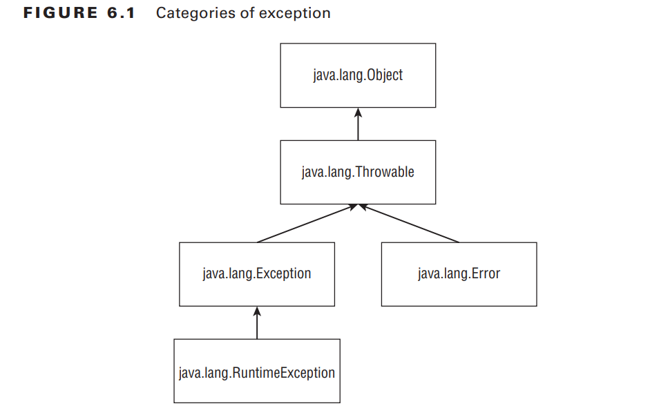
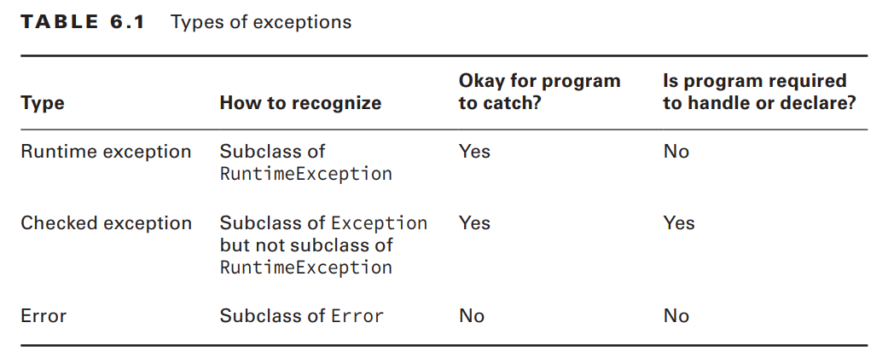
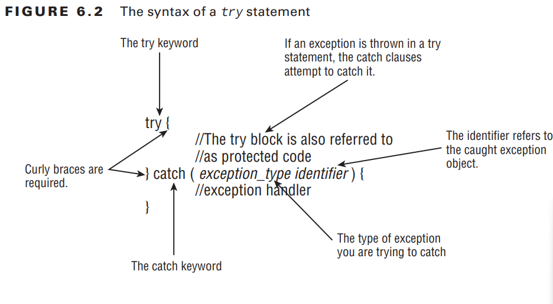
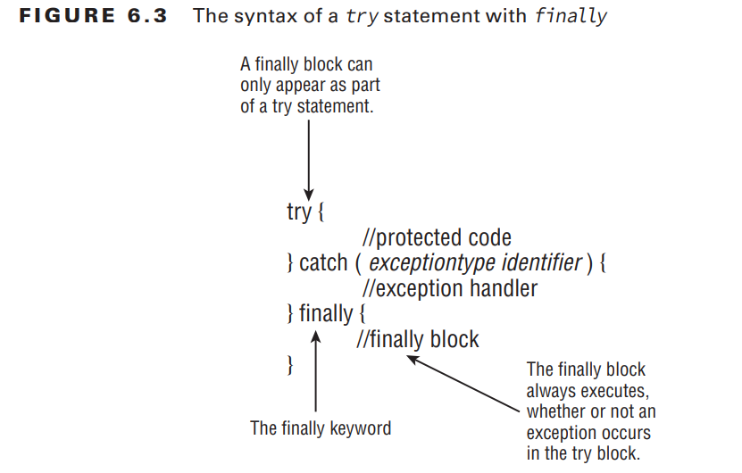

# Understanding Exceptions p.300

A program can fail for just about any reason. Here are just a few possibilities:

- The code tries to connect to a website, but the Internet connection is down.
- You made a coding mistake and tried to access an invalid index in an array.
- One method calls another with a value that the method doesn’t support

## The Role of Exceptions p.300

These are the two approaches Java uses when dealing with exceptions.

- A method canhandle the exception case itself
- or make it the caller’s responsibility.

- An exception forces the program to deal with them or end with the exception if left unhandled,
- whereas a return code could be accidentally ignored and cause problems later in the program. An exception is like shouting, “Deal with me!”

## Understanding Exception Types .p302

an exception is an event that alters program flow. Java has a `Throwable`
superclass for all objects that represent these events.


- `Error` means something went so horribly wrong that your program should not attempt to recover from it.
- `Runtime exceptions` tend to be unexpected but not necessarily fatal.Runtime exceptions are also known as `unchecked exceptions.`
- `Checked exceptions` tend to be more anticipated—for example, trying to read a file that doesn’t exist.

Java requires the code to either handle them or declare them in the method signature when it is a checked exception.

```java
void fall() throws Exception {
 throw new Exception();
}
```

- `throws` simply declares that the method might throw an Exception. It also might not.

For the OCA exam, you need to know the rules for how checked versus unchecked
exceptions function.

## Throwing an Exception p.304

On the exam, you will see two types of code that result in an exception. `The first is code that’s wrong`

```java
String[] animals = new String[0];
System.out.println(animals[0]); //This code throws an ArrayIndexOutOfBoundsException.
```

The second way for code to result in an exception is `to explicitly request Java to throw one`.

```java
throw new Exception();
throw new Exception("Ow! I fell.");
throw new RuntimeException();
throw new RuntimeException("Ow! I fell.");
```



# Using a try Statement p.305

Java uses a `try statement` to separate the logic that might throw an exception from the logic to handle that exception.


The code in the try block is run normally. If any of the statements throw an exception
that can be caught by the exception type listed in the catch block, the try block stops running and execution goes to the catch statement. If none of the statements in the try block
throw an exception that can be caught, the catch clause is not run.

- “block” and “clause” used interchangeably.

```java
 void explore() {
 try {
 fall();
 System.out.println("never get here");
 } catch (RuntimeException e) {
 getUp();
 }
 seeAnimals();
 }
void fall() { throw new RuntimeException(); }
```

```java
try // DOES NOT COMPILE - braces are missing
 fall();
catch (Exception e)
 System.out.println("get up");
```

```java
try {// DOES NOT COMPILE - missing catch clause
 fall();
}
```

## Adding a finally Block p.307

The try statement also lets you run code at the end with a `finally clause` regardless of
whether an exception is thrown.


```java
 void explore() {
 try {
 seeAnimals();
 fall();
 } catch (Exception e) {
 getHugFromDaddy();
 } finally {
 seeMoreAnimals();
 }
 goHome();
 }
```

On the OCA exam, a try statement must have catch and/or finally.

```java
 try { // DOES NOT COMPILE - catch and finally blocks are in the wrong order.
 fall();
 } finally {
 System.out.println("all better");
 } catch (Exception e) {
 System.out.println("get up");
 }

 try { // DOES NOT COMPILE - needs catch/finally block
 fall();
 }

 try { // compiles fine -  catch is not required if finally is present.
 fall();
 } finally {
 System.out.println("all better");
 }
```

When `System.exit` is called in the try or catch block, finally does not run.

## Catching Various Types of Exceptions p.309

the OCA exam can defi ne basic exceptions to show you the hierarchy. You only
need to do two things with this information. First, you must be able to recognize if the
exception is a checked or an unchecked exception.

```java
class AnimalsOutForAWalk extends RuntimeException { }
class ExhibitClosed extends RuntimeException { }
class ExhibitClosedForLunch extends ExhibitClosed { }
```

```java
public void visitPorcupine() {
 try {
 seeAnimal();
 } catch (AnimalsOutForAWalk e) {// first catch block
 System.out.print("try back later");
 } catch (ExhibitClosed e) {// second catch block
 System.out.print("not today");
 }
}
```

A rule exists for the order of the catch blocks. Java looks at them in the order they
appear. If it is impossible for one of the catch blocks to be executed, a compiler error
about unreachable code occurs. `This happens when a superclass is caught before a subclass.`

```java
public void visitMonkeys() {
 try {
 seeAnimal();
 } catch (ExhibitClosedForLunch e) {// subclass exception
 System.out.print("try back later");
 } catch (ExhibitClosed e) {// superclass exception
 System.out.print("not today");
 }
}
```

```java
public void visitMonkeys() {
 try {
 seeAnimal();
 } catch (ExhibitClosed e) {
 System.out.print("not today");
 } catch (ExhibitClosedForLunch e) {// DOES NOT COMPILE - superclass is caught before a subclass - there is no way for the second catch block to ever run
 System.out.print("try back later");
 }
}
```

```java
public void visitSnakes() {
 try {
 seeAnimal();
 } catch (RuntimeException e) {
 System.out.print("runtime exception");
 } catch (ExhibitClosed e) {// DOES NOT COMPILE - ExhibitClosed is a RuntimeException-  no way to get to the second catch block
 System.out.print("not today");
 } catch (Exception e) {
 System.out.print("exception");
 }
}
```

## Throwing a Second Exception p.311

a catch or finally block can have any valid Java code in it—including another
try statement.

Most of the examples you see with exception handling on the exam are abstract. They
use letters or numbers to make sure you understand the fl ow. This one shows that only the
last exception to be thrown matters.

```java
 try {
 throw new RuntimeException();
 } catch (RuntimeException e) {
 throw new RuntimeException(); //The exception from the catch block gets forgotten about.
 } finally {
 throw new Exception(); // last exception to be thrown matters
 }
```

```java
 public String exceptions() {
 String result = "";
 String v = null;
 try {
 try {
 result += "before";
 v.length();
 result += "after";
 } catch (NullPointerException e) {
 result += "catch";
 throw new RuntimeException();
 } finally {
 result += "finally";
 throw new Exception();
 }
 } catch (Exception e) {
 result += "done";
 }
 return result;
}
// Outputss: before catch finally done
```

# Recognizing Common Exception Types p.313

- runtime exceptions,
- checked exceptions,
- and errors.

you’ll need to recognize which type of an exception it is and whether it’s thrown by
the JVM or a programmer.

## Runtime Exceptions p.314

360/368

## Checked Exceptions p.317

## Errors p.317

# Calling Methods That Throw Exceptions p. 318

## Subclasses p.319

## Printing an Exception p.321

# Summary p.323

# Exam Essentials p.324

# Review Questions Result
